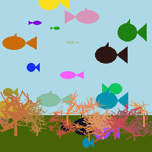
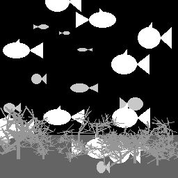

# underwater-dataset-gen
Simple python scripts to generate simplified underwater images of fish, sharks and branching corals. Meant to generate a simple dataset for a semantic segmentation demonstration.
Images such as these are generated together with a mask.

Sample image of a generated scene.            |  And the corresponding mask.
:-------------------------:|:-------------------------:
  |  

The labels in the mask are as follows:
 - 0: Background
 - 1: Ground
 - 2: Fish
 - 3: Shark
 - 4: Coral

The generated images are randomly blurred with gaussian blurring using a radius of 1 or 2.

## Installation

## Usage
